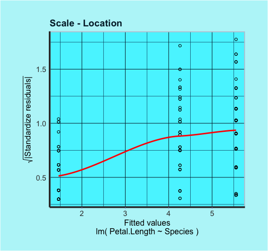

```{r setup, include = FALSE}
knitr::opts_chunk$set(
  collapse = TRUE,
  comment = "#>"
)
```

## Installation:

To install the package it's necessary to download it from github.  
The function `devtools::install_github("stasinak/AdvPro4")` will do the trick!

<!-- 
```{r , eval=FALSE}
devtools::install_github("stasinak/AdvPro4")
```
 -->

$~$

## Usage:

This package allows the user to create objects of a new RC class, called `linreg`, that consists in an alternative way to implement the linear regression.  
In order to create the objects, you need to input the formula specified by the user and the dataset to which it refers as parameters.

```{r }
# Importing the library:
library(Linear.reg)

# Import a sample dataset
data(iris)

# Creating an object of class 'linreg'
linreg_mod <- linreg$new(formula = Petal.Length~Species, data = iris)
```

## Methods

The class provides various methods that closely resemble 
contains a linear regression fit based on the `formula` and on the `data` the user provides.The model automatically calculates the Regressions Coefficients,the fitted values,the residuals,the degrees of freedom,the residual variance,the variance of the regression coefficients,the t-values for each coefficient.

After the object is created, the user can use the methods linreg.print(),linreg.plot(),linreg.resid(),linreg.pred(),linreg.coef(),linreg.summary().

## Methods

### print()

The print method prints the coefficients and coefficient names.

```{r }
linreg_mod$print()
```
### plot()

The plot method returns two plots.One plot with Residuals vs Fitted Values and the other one the Square of Standartized residuals vs Fitted values. 

<!-- </img> -->
<!-- </img> -->
 
```{r, message=F, warning=F, fig.width=4, fig.height=4}
plots <- linreg_mod$plot()
plots$residuals_vs_fitted
plots$stand.residuals_vs_fitted
```
 

### resid()

resid method returns the vector of residuals e.
```{r}
linreg_mod$resid()

```

### pred()
Pred method  returns the predicted values yˆ.
$$\hat\beta = X^TX $$
```{r }

linreg_mod$pred()

```


### coef()
Coef method  returns the coefficients as a named vector

```{r }
linreg_mod$coef()

```


### summary()
Summary returns the coefficients with their standard error, t-value and p-value as well as the estimate of ˆσ and the degrees
of freedom in the model.

```{r }
linreg_mod$summary()

```


