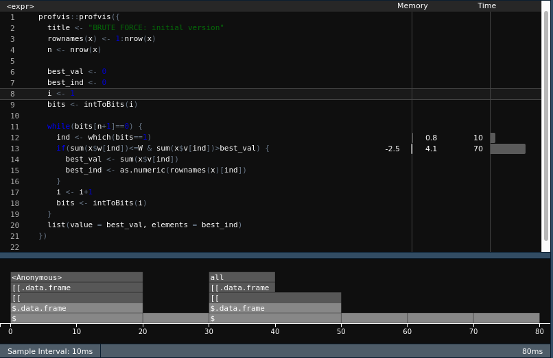
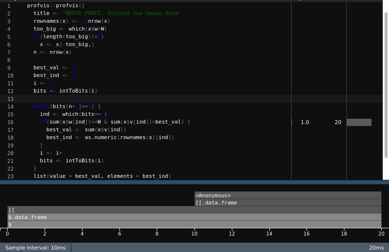
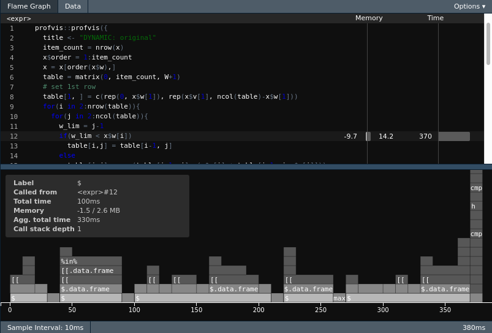
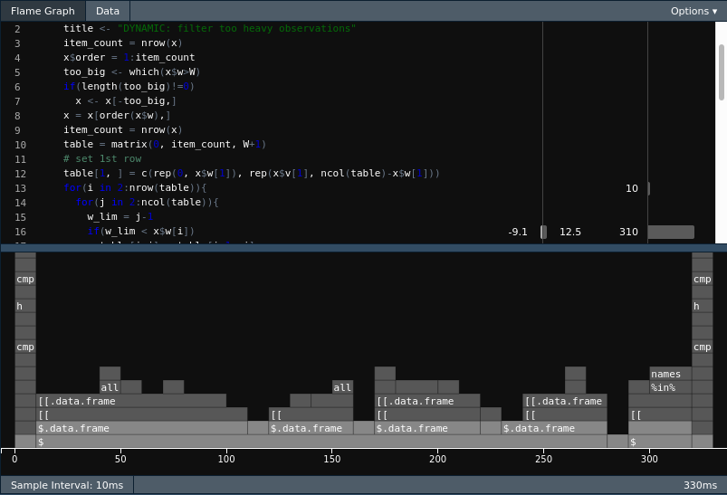
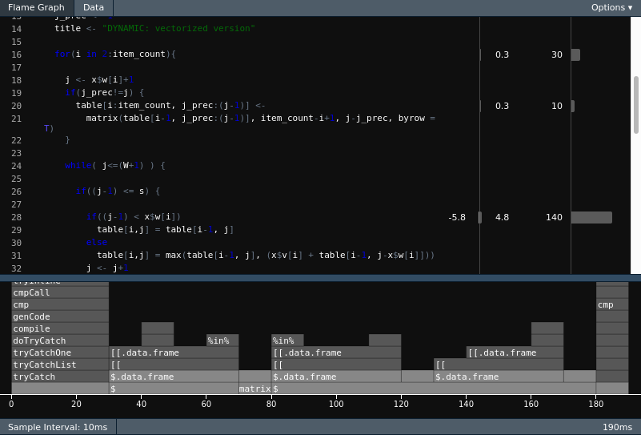
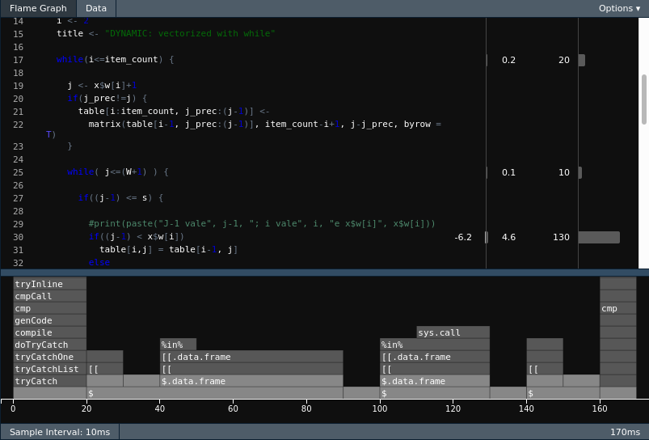
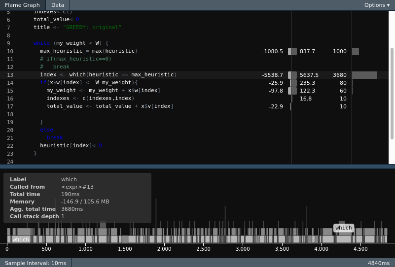
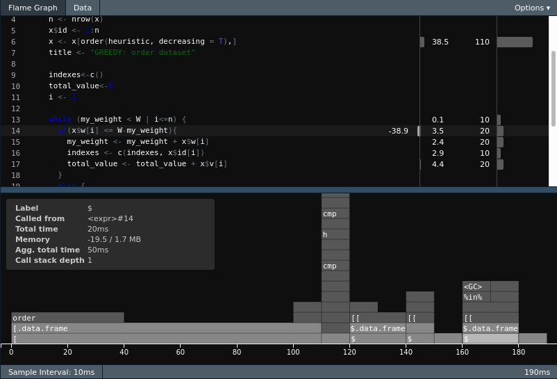

```{r setup, include = FALSE}
knitr::opts_chunk$set(
  collapse = TRUE,
  comment = "#>"
)
```

#To install the package
```{r, eval=FALSE}
devtools::install_github("stasinak/Adv_R6")
```


###The user can solve the Knapsack problem using 3 different approaches.The code which used above are already optimized!


##The first alogorith is the Bruce force search.
The only solution that is guaranteed to give a correct answer in all situations for the knapsack problem is using brute-force search, i.e. going through all possible alternatives and return the maximum value
found. This approach is of complexity O(2n) since all possible combinations 2n needs to be evaluated.

###To use the Bruce force algorith:
```{r}
library(AdvR6)
AdvR6::brute_force_knapsack(x = knapsack_objects[1:8,], W = 3500)
AdvR6::brute_force_knapsack(x = knapsack_objects[1:12,], W = 3500)
```
###Question How much time does it takes to run the algorithm for n = 16 objects?
```{r}
system.time(AdvR6::brute_force_knapsack(x = knapsack_objects[1:16,], W = 3500))
```


##The second algorithm is using dynamic programming
This algorithm  can solve the knapsack problem exact by iterating
over all possible values of w.

###How to use dynamic approach:
```{r}
AdvR6::dynamic_knapsack(x = knapsack_objects[1:8,], W = 3500)
AdvR6::dynamic_knapsack(x = knapsack_objects[1:12,], W = 3500)
```

###Question How much time does it takes to run the algorithm for n = 500 objects?
```{r}
system.time(AdvR6::dynamic_knapsack(x = knapsack_objects[1:500,], W = 3500))
```

##The third algorithm is using Greedy heuristic:
This algorithm will not give an exact result (but it can be shown that it will return at least 50% of the true maximum value),
but it will reduce the computational complexity considerably (actually to O(n log n) due to the sorting
part of the algorithm).

###How to use Greedy algorithm:
```{r}
AdvR6::greedy_knapsack(x = knapsack_objects[1:800,], W = 3500)
AdvR6::greedy_knapsack(x = knapsack_objects[1:1200,], W = 2000)
```

###Question How much time does it takes to run the algorithm for n = 1000000 objects?

```{r}

system.time(AdvR6::greedy_knapsack(x = knapsack_objects[1:1000000,], W = 2000))
```


###Question: What performance gain could you get by trying to improving your code?
####Brute force algorithm :
In this algorithm we realized if we use while loops instead of for loops we can gain speed because creating list or vector in for loop takes time.
For optimizing our algorithm, we eliminate the elements which its weight is greater than the knapsack size, as a result we can gain some performance in our loops. 
We also create a parallelized version of this algorithm which divides the problem into iterations and we distributed these iterations to cores.

###Dynamic algorithm :

In this algorithm we gain speed because we vectorize the problem instead of putting and checing the same values until the end of row one by one.

###Greedy algorithm :

This algorithm stops when it find the correct solution. Despite the fact that this algorithm is the fastest one we gained speed(again) because we sort the elements by heuristic instead of getting the max heuristic value in every iteration.

###Profiling:
####Brute force algorithm :
**First Algorithm**


ANALYSIS FOR FIRST

**Optimized Algorithm**


ANALYSIS FOR FIRST

###Dynamic algorithm :
**First Algorithm**



ANALYSIS FOR FIRST

**Optimized Algorithm**




ANALYSIS FOR FIRST

###Greedy algorithm :
**First Algorithm**


ANALYSIS FOR FIRST

**Optimized Algorithm**


ANALYSIS FOR FIRST


##Finally,in brute force algorithm the user can use parallel programming just adding parallel=TRUE :
```{r}


AdvR6::brute_force_knapsack(x = knapsack_objects[1:8,], W = 3500)
```
